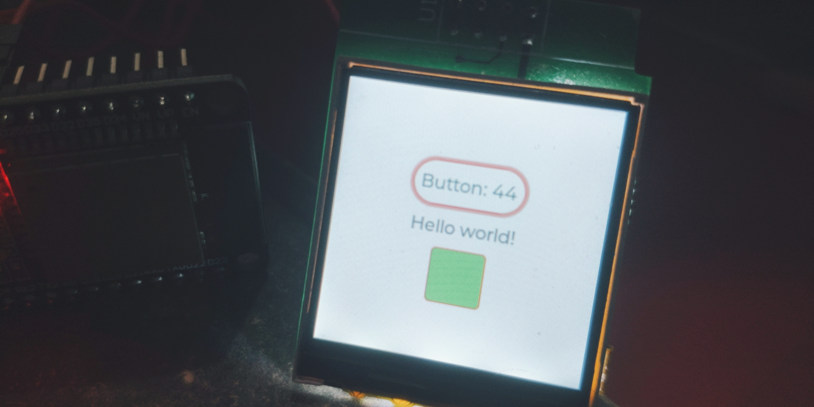

# LVGL project for ESP32

This is an ESP32 demo project showcasing LVGL v7 with support for several display controllers and touch controllers.

移植自官方仓库 https://github.com/lvgl/lv_port_esp32

IDF版本: ESP-IDF v4.2-dev-1905-g625bd5eb1-dirty

效果演示

